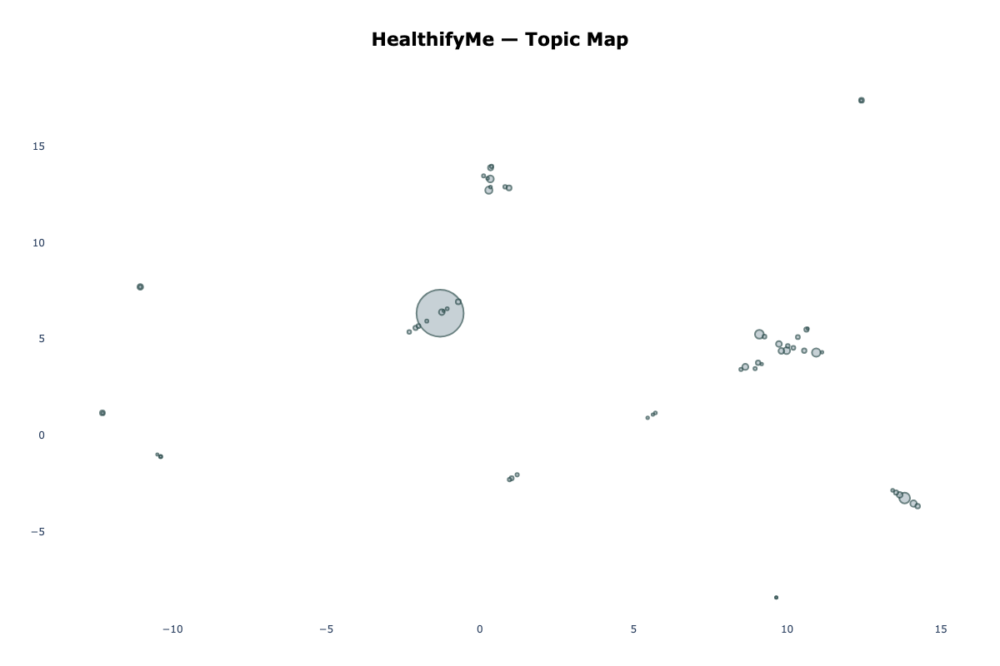
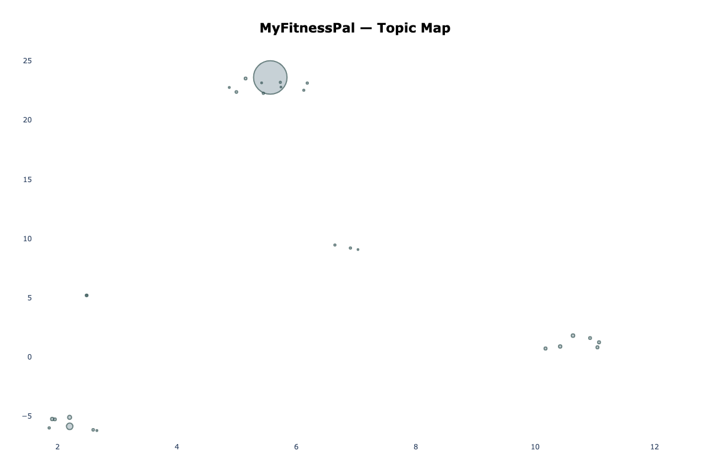
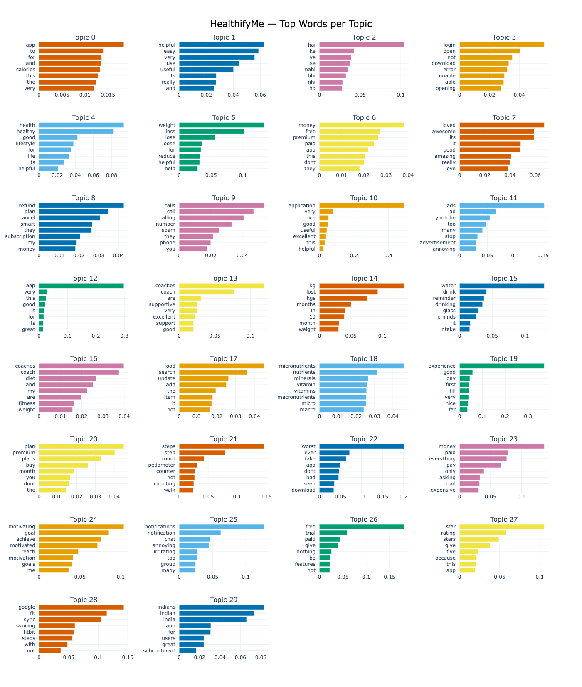
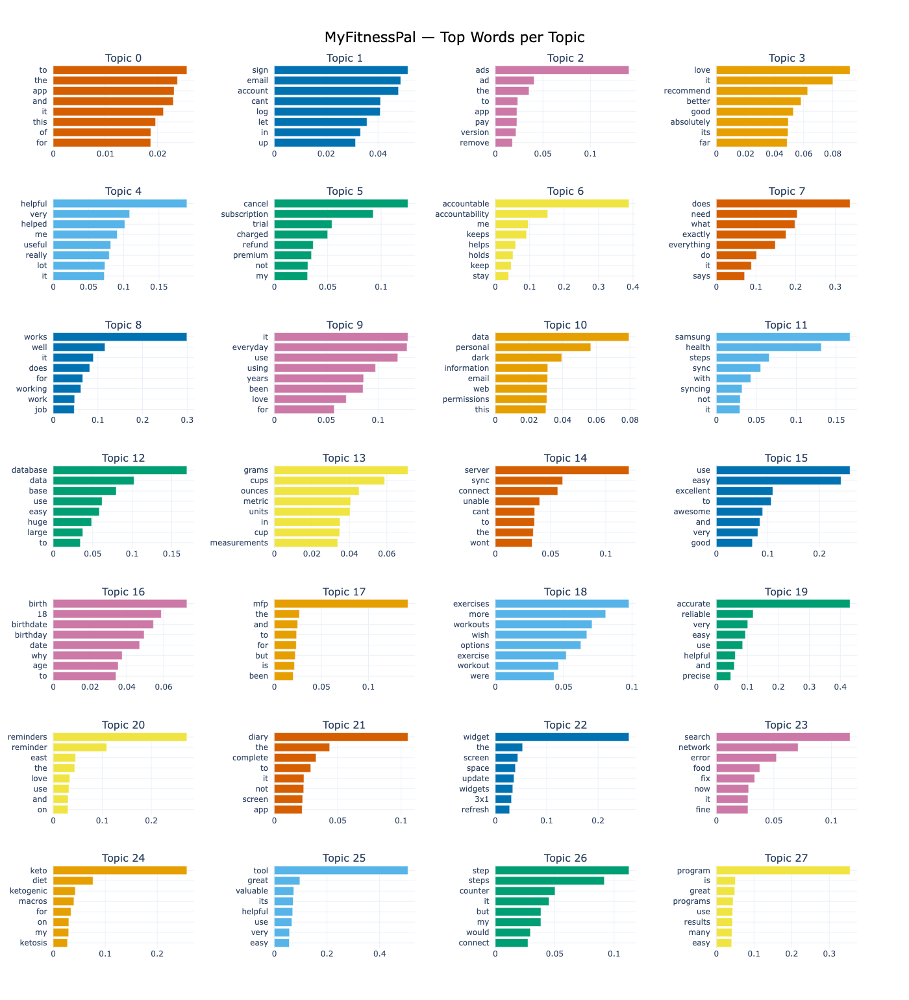
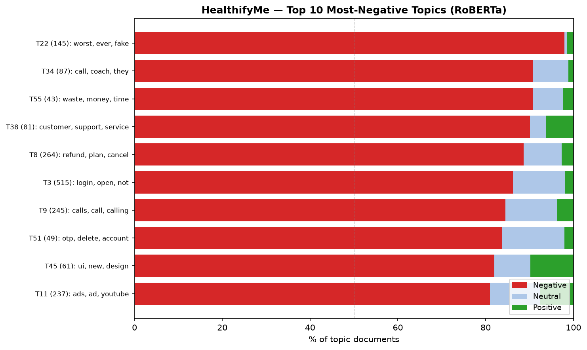
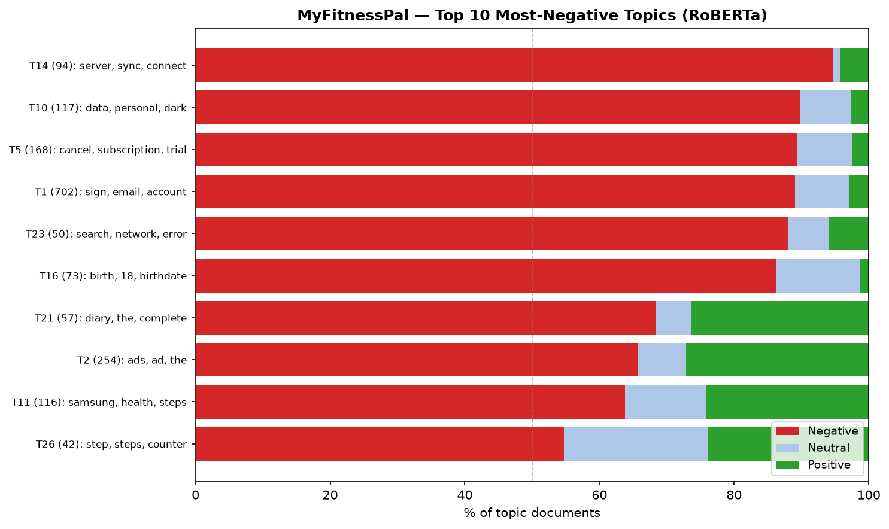
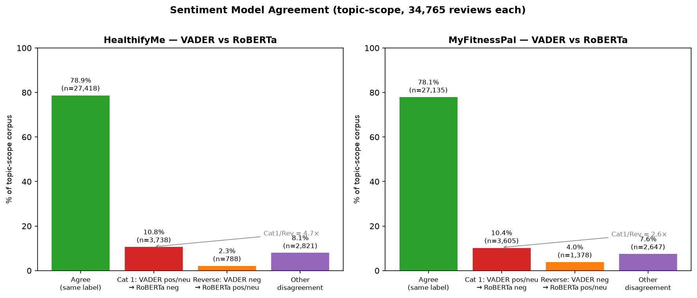

# HealthifyMe vs MyFitnessPal — Text Analytics

A Python rebuild of a course project originally completed in Orange Data Mining.
The rebuild upgrades every methodological component: LDA → BERTopic, VADER-only → VADER + transformer
comparison, undocumented sampling → seeded stratified sampling, and adds silhouette scoring
that the original pipeline could not compute.

---

## Scope note

The original project drew from two sources: Play Store reviews (HealthifyMe 65,518 +
MyFitnessPal sample 62,265) **plus YouTube comments** collected via the YouTube Data API v3.
This rebuild uses **only the Play Store review datasets**. YouTube comments are not included.
This is an intentional scope difference, not an omission — the analysis is grounded in a single,
consistent data source rather than mixing review and comment corpora.

---

## Problem statement

Two leading fitness-tracking apps compete for the same users in overlapping markets:
HealthifyMe is India-first with a human-coaching model; MyFitnessPal is Western-origin with
a large food database and third-party integrations. Both have >60% 5-star ratings yet both
have high-negativity topic clusters reaching 88–98% RoBERTa-negative sentiment. The
question is: what are users most upset about, does the complaint profile differ between apps,
and where should each team invest next?

---

## Methodology: original pipeline vs this rebuild

| Dimension | Original (Orange) | This rebuild |
|---|---|---|
| **Topic model** | LDA, n_components=5, max_iter=20, CountVectorizer(max_features=1000, min_df=5, max_df=0.85) | BERTopic + all-MiniLM-L6-v2 sentence embeddings (384-dim), UMAP(n_components=5, n_neighbors=15, min_dist=0.0, cosine), HDBSCAN(min_cluster_size=40, min_samples=10) |
| **Topic quality metric** | Log perplexity 145.70, coherence C_v 0.51389 ("moderate-good") | Silhouette on UMAP-5D embeddings: HFY −0.2789, MFP −0.4686 (real topics only; Orange skips silhouette above 5,000 docs) |
| **Cluster validation** | K-Means k=5 on Bag-of-Words, used as convergent validation. Silhouette not computed. | No K-Means; silhouette directly on BERTopic's UMAP output |
| **Sentiment** | VADER only | VADER + cardiffnlp/twitter-roberta-base-sentiment-latest; disagreement quantified at 10.75% (HFY) and 10.37% (MFP) of corpus |
| **MFP sampling** | ~62,265 rows; method undocumented | Rating-stratified sample of 34,765 rows, seed=42, logged in code |
| **Corpus size (topic scope)** | ~128K across both apps + YouTube | 34,765 per app (Play Store only) |

The BERTopic coherence comparison against C_v 0.51389 is indirect — BERTopic does not
produce a C_v score — but the silhouette scores provide a cluster-quality signal the original
pipeline explicitly could not compute. The relative comparison (HFY −0.2789 vs MFP −0.4686)
is internally consistent since both models were fit with identical parameters.

---

## Data and cleaning

| Step | HealthifyMe | MyFitnessPal |
|---|---|---|
| Raw rows loaded | 65,518 | 661,512 |
| After cleaning | 63,147 | 653,650 |
| Topic-scope (≥20 chars) | 34,765 | 34,765 (stratified sample) |

Cleaning steps applied to both datasets:
1. Drop all-null columns
2. Normalize `developer_response` / add `has_dev_response` boolean
3. Drop null/empty `review_description` rows
4. Parse `review_date` to datetime64
5. Flag `possible_mixed_sentiment` (rating ≤ 3 + temporal/contrast regex)
6. Language detection via langid (non-ASCII rows only; ASCII rows labeled `en` directly)
7. Drop non-English rows
8. Add `app_label`

Full per-step counts are in `notebooks/01_data_cleaning.ipynb`.

---

## Key findings

### Rating distribution

| Stars | HealthifyMe | MyFitnessPal |
|---|---|---|
| 1★ | 13.7% | 8.0% |
| 2★ | 2.6% | 3.0% |
| 3★ | 4.7% | 4.4% |
| 4★ | 13.8% | 16.8% |
| 5★ | 65.3% | 67.8% |

Both apps are skewed positive in star ratings, but VADER and RoBERTa both identify more
negativity than the raw rating distribution suggests — especially in the 3★ range where
"used to be great, but..." reviews are common.

### Topic structure

| | HealthifyMe | MyFitnessPal |
|---|---|---|
| Real topics | 59 | 28 |
| Docs in real topics | 24,876 (71.6%) | 21,974 (63.2%) |
| Outlier docs | 9,889 (28.4%) | 12,791 (36.8%) |
| Silhouette (real topics) | −0.2789 | −0.4686 |

HealthifyMe's complaints are more fragmented (59 themes) but more internally coherent
(less negative silhouette). MyFitnessPal's complaints consolidate into fewer, denser
clusters with more diffuse within-cluster geometry.

**BERTopic topic maps** (hover for top words):

| HealthifyMe | MyFitnessPal |
|---|---|
| [Interactive HTML](visuals/interactive/hfy_topic_map.html) | [Interactive HTML](visuals/interactive/mfp_topic_map.html) |
|  |  |

**Top-words bar charts** (top 30 topics):

| HealthifyMe | MyFitnessPal |
|---|---|
| [Interactive HTML](visuals/interactive/hfy_topic_barchart.html) | [Interactive HTML](visuals/interactive/mfp_topic_barchart.html) |
|  |  |

### Most-negative topics (RoBERTa)




**HealthifyMe top 5 most negative:**

| Topic | % Negative | Theme |
|---|---|---|
| T22 | 97.9% | worst, ever, fake, app |
| T34 | 90.8% | call, coach, coaches, money |
| T55 | 90.7% | waste, money, time |
| T38 | 90.1% | customer, support, service |
| T8  | 88.6% | refund, cancel, subscription |

**MyFitnessPal top 5 most negative:**

| Topic | % Negative | Theme |
|---|---|---|
| T14 | 94.7% | server, sync, connect |
| T10 | 89.7% | data, personal, dark, permissions |
| T5  | 89.3% | cancel, subscription, trial, refund |
| T1  | 89.0% | sign, email, account, cant log in |
| T23 | 88.0% | search, network, error, food |

### Sentiment model comparison



| Model | HFY % Positive | HFY % Neutral | HFY % Negative | MFP % Positive | MFP % Neutral | MFP % Negative |
|---|---|---|---|---|---|---|
| VADER | 74.3% | 10.3% | 15.4% | 80.2% | 8.4% | 11.4% |
| RoBERTa | 64.1% | 12.0% | 23.9% | 73.1% | 9.2% | 17.8% |
| Agreement | — | — | 78.9% | — | — | 78.1% |

RoBERTa identifies ~8–9 percentage points more negativity than VADER for both apps.
The disagreement is strongly directional: VADER labels a review positive or neutral while
RoBERTa calls it negative at **4.7×** the reverse rate for HealthifyMe and **2.6×** for
MyFitnessPal. This asymmetry indicates that ironic, hedged, and "used to be great" reviews
systematically fool VADER in both corpora.

Mixed-sentiment prevalence (rating ≤ 3 + temporal/contrast pattern): HFY 1.53% of full
corpus (964 rows), MFP 2.95% (19,252 rows). MFP's higher rate is consistent with a wave
of "before vs after paywall" nostalgia reviews.

### Developer responsiveness

| Metric | HealthifyMe | MyFitnessPal |
|---|---|---|
| Overall response rate | 58.1% | 10.7% |
| Response rate on 1★ | 93.6% | 62.4% |

HealthifyMe responds at roughly 5× the rate of MyFitnessPal. This is a genuine
operational differentiator, but it also raises user expectations — any regression in
response cadence will be felt more acutely than at MFP.

---

## Recommendations

Full RICE-scored recommendations in [`memo.md`](memo.md).

**HealthifyMe (ranked by RICE):**

| Rank | Recommendation | RICE |
|---|---|---|
| 1 | Publish public feature roadmap | 72 |
| 2 | Restructure subscription and refund flow | 60 |
| 3 | Indian food database + vernacular coverage | 40.5 |
| 4 | Coaching model quality standards | 27 |

**MyFitnessPal (ranked by RICE):**

| Rank | Recommendation | RICE |
|---|---|---|
| 1 | Fix login / account recovery | 113.4 |
| 2 | Address paywall and dark-pattern backlash | 45 |
| 3 | Stabilize third-party sync | 40.5 |
| 4 | Indian market localization | 21.3 |

---

## Project structure

```
├── data/
│   ├── raw/                    # gitignored
│   └── processed/              # gitignored (reproducible from pipeline)
├── data/embeddings/            # gitignored (.npy caches)
├── models/                     # gitignored (BERTopic .pkl files)
├── notebooks/
│   ├── 01_data_cleaning.ipynb
│   └── 02_eda.ipynb
├── src/
│   ├── clean_data.py           # cleaning pipeline
│   ├── topic_modeling.py       # BERTopic wrapper + reporting
│   └── sentiment.py            # VADER + transformer inference
├── visuals/
│   ├── interactive/            # Plotly HTML files
│   └── *.png                   # static exports for README
├── findings_summary.md         # all validated numbers
├── memo.md                     # RICE-scored recommendations
└── requirements.txt
```

## Stack

`pandas` · `sentence-transformers` · `bertopic` · `vaderSentiment` ·
`transformers` (HuggingFace) · `scikit-learn` · `matplotlib` · `seaborn` · `plotly`
